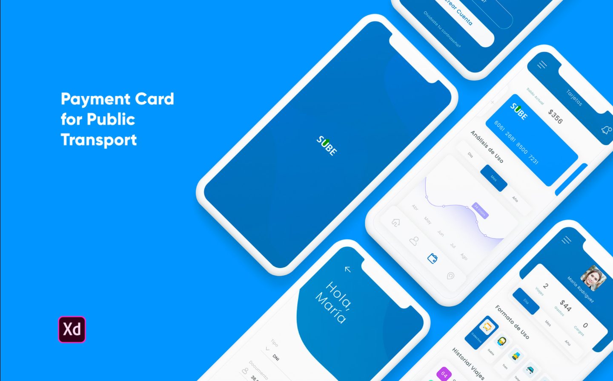
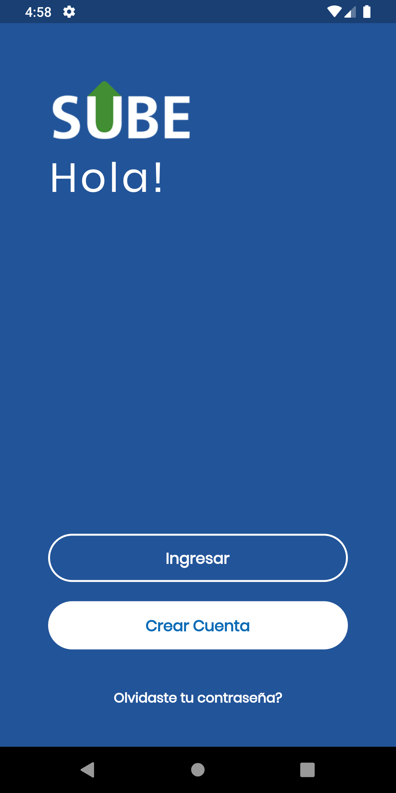
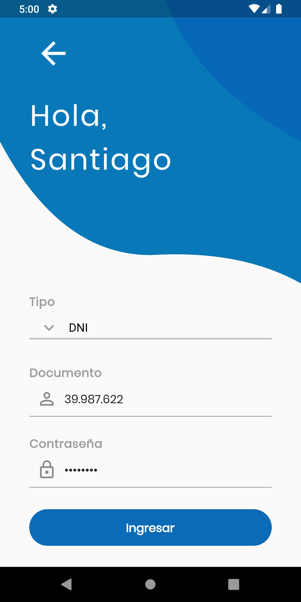
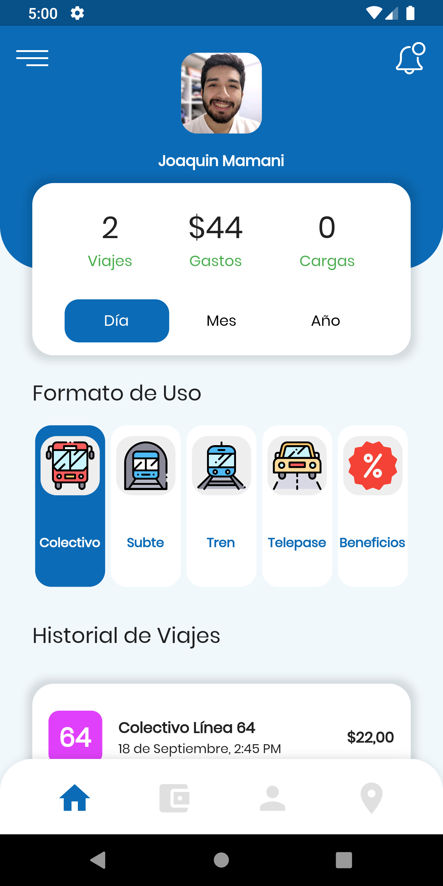
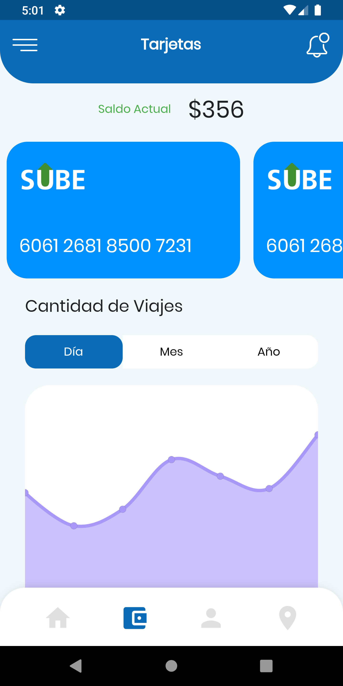
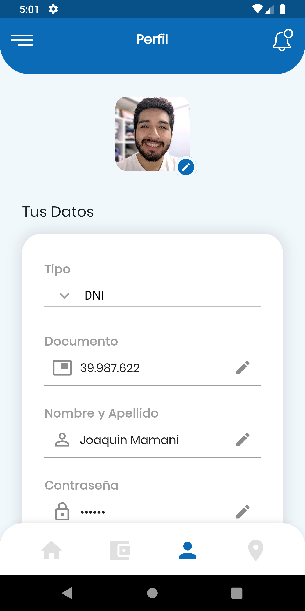

# SUBE App
 Rediseño de la app SUBE hecha en Flutter
 
# Getting Started
 Para instalar el proyecto se debe ejecutar el siguiente comando en la carpeta raíz del proyecto
 ```
  flutter packages get
```

# Paquetes utilizados

- <a href="https://pub.dev/packages/provider" target="_blank">provider</a>
- <a href="https://pub.dev/packages/google_fonts" target="_blank">google_fonts</a>
- <a href="https://pub.dev/packages/fl_chart" target="_blank">fl_chart</a>
- <a href="https://pub.dev/packages/mapbox_gl" target="_blank">mapbox_gl</a>

# Créditos del diseño
El proyecto está inspirado en el diseño de [Lautaro Malloti](https://www.behance.net/gallery/96421803/SUBE-App-Mobile).



# Resultado

  
 

# Demo

Acceda al siguiente enlace: <a href="https://s4.gifyu.com/images/sube.gif" target="_blank">https://s4.gifyu.com/images/sube.gif</a>
